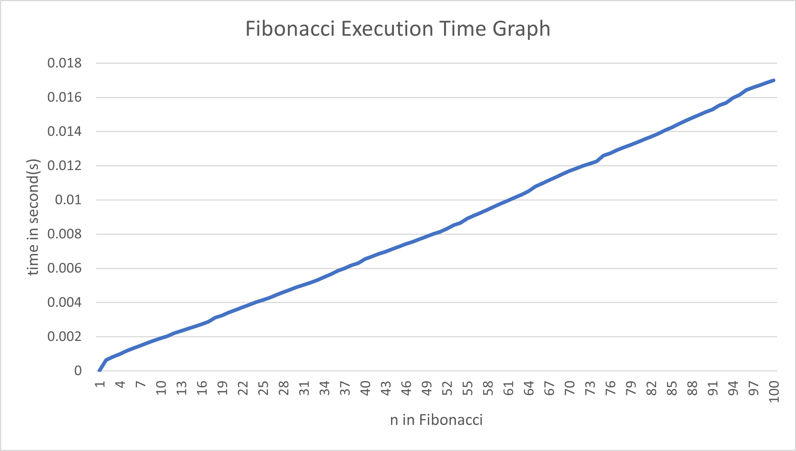

# CS3980 Assignment 1 Python Refresher - Alan Chen

This repository contains Python scripts for the Python Refresher Assignment
1. `echo.py` - a script that imitates a real-world echo.
2. `fib.py` - a script that calculates the Fibonacci sequence and measures execution time.
## 0. Create a GitHub Repository
Link: https://github.com/AlanCTB/CS3980-Assignment1-Python-Refresher
## 1. Python Programming Basics
The `echo.py` script simulates an echo effect.

### Example output using the code:
Yell something at a mountain: Helloooo
ooo
oo
o
.

## 2. Python Decorator Implementation
The `fib.py` script computes Fibonacci numbers using a recursive approach. To optimize performance, it utilizes the lru_cache decorator from the functools package to memoize previous results.

### Example output using the code:
Finished in 0.00000160s: f(0) -> 0
Finished in 0.00044330s: f(2) -> 1
Finished in 0.00055240s: f(3) -> 2
Finished in 0.00073010s: f(4) -> 3
Finished in 0.00080670s: f(5) -> 5
Finished in 0.00085940s: f(6) -> 8
Finished in 0.00091270s: f(7) -> 13
Finished in 0.00096140s: f(8) -> 21
Finished in 0.00102280s: f(9) -> 34
Finished in 0.00107970s: f(10) -> 55
Finished in 0.00137280s: f(11) -> 89
Finished in 0.00301470s: f(12) -> 144
Finished in 0.00323460s: f(13) -> 233
Finished in 0.00340440s: f(14) -> 377
Finished in 0.00361230s: f(15) -> 610
Finished in 0.00380660s: f(16) -> 987
Finished in 0.00400360s: f(17) -> 1597
Finished in 0.00425040s: f(18) -> 2584
Finished in 0.00440130s: f(19) -> 4181
Finished in 0.00455360s: f(20) -> 6765
Finished in 0.00467800s: f(21) -> 10946
Finished in 0.00484120s: f(22) -> 17711
Finished in 0.00499740s: f(23) -> 28657
Finished in 0.00514360s: f(24) -> 46368
Finished in 0.00530300s: f(25) -> 75025
Finished in 0.00544710s: f(26) -> 121393
Finished in 0.00559380s: f(27) -> 196418
Finished in 0.00574170s: f(28) -> 317811
Finished in 0.00587810s: f(29) -> 514229
Finished in 0.00600420s: f(30) -> 832040
Finished in 0.00614730s: f(31) -> 1346269
Finished in 0.00628580s: f(32) -> 2178309
Finished in 0.00642300s: f(33) -> 3524578
Finished in 0.00656450s: f(34) -> 5702887
Finished in 0.00672630s: f(35) -> 9227465
Finished in 0.00687400s: f(36) -> 14930352
Finished in 0.00702200s: f(37) -> 24157817
Finished in 0.00717090s: f(38) -> 39088169
Finished in 0.00732450s: f(39) -> 63245986
Finished in 0.00747800s: f(40) -> 102334155
Finished in 0.00763390s: f(41) -> 165580141
Finished in 0.00779450s: f(42) -> 267914296
Finished in 0.00797260s: f(43) -> 433494437
Finished in 0.00814330s: f(44) -> 701408733
Finished in 0.00828180s: f(45) -> 1134903170
Finished in 0.00842810s: f(46) -> 1836311903
Finished in 0.00856050s: f(47) -> 2971215073
Finished in 0.00871280s: f(48) -> 4807526976
Finished in 0.00890530s: f(49) -> 7778742049
Finished in 0.00906220s: f(50) -> 12586269025
Finished in 0.00922990s: f(51) -> 20365011074
Finished in 0.00940410s: f(52) -> 32951280099
Finished in 0.00957850s: f(53) -> 53316291173
Finished in 0.00973610s: f(54) -> 86267571272
Finished in 0.00989330s: f(55) -> 139583862445
Finished in 0.01003730s: f(56) -> 225851433717
Finished in 0.01023390s: f(57) -> 365435296162
Finished in 0.01039480s: f(58) -> 591286729879
Finished in 0.01059500s: f(59) -> 956722026041
Finished in 0.01087470s: f(60) -> 1548008755920
Finished in 0.01106630s: f(61) -> 2504730781961
Finished in 0.01126810s: f(62) -> 4052739537881
Finished in 0.01143820s: f(63) -> 6557470319842
Finished in 0.01161930s: f(64) -> 10610209857723
Finished in 0.01177900s: f(65) -> 17167680177565
Finished in 0.01193580s: f(66) -> 27777890035288
Finished in 0.01209650s: f(67) -> 44945570212853
Finished in 0.01223630s: f(68) -> 72723460248141
Finished in 0.01237220s: f(69) -> 117669030460994
Finished in 0.01252700s: f(70) -> 190392490709135
Finished in 0.01267760s: f(71) -> 308061521170129
Finished in 0.01282210s: f(72) -> 498454011879264
Finished in 0.01298120s: f(73) -> 806515533049393
Finished in 0.01315680s: f(74) -> 1304969544928657
Finished in 0.01333310s: f(75) -> 2111485077978050
Finished in 0.01349090s: f(76) -> 3416454622906707
Finished in 0.01377310s: f(77) -> 5527939700884757
Finished in 0.01392740s: f(78) -> 8944394323791464
Finished in 0.01419450s: f(79) -> 14472334024676221
Finished in 0.01432970s: f(80) -> 23416728348467685
Finished in 0.01447680s: f(81) -> 37889062373143906
Finished in 0.01464030s: f(82) -> 61305790721611591
Finished in 0.01480210s: f(83) -> 99194853094755497
Finished in 0.01495840s: f(84) -> 160500643816367088
Finished in 0.01511970s: f(85) -> 259695496911122585
Finished in 0.01527720s: f(86) -> 420196140727489673
Finished in 0.01544420s: f(87) -> 679891637638612258
Finished in 0.01560720s: f(88) -> 1100087778366101931
Finished in 0.01577120s: f(89) -> 1779979416004714189
Finished in 0.01594930s: f(90) -> 2880067194370816120
Finished in 0.01612110s: f(91) -> 4660046610375530309
Finished in 0.01628050s: f(92) -> 7540113804746346429
Finished in 0.01644650s: f(93) -> 12200160415121876738
Finished in 0.01662280s: f(94) -> 19740274219868223167
Finished in 0.01678880s: f(95) -> 31940434634990099905
Finished in 0.01695920s: f(96) -> 51680708854858323072
Finished in 0.01712950s: f(97) -> 83621143489848422977
Finished in 0.01730310s: f(98) -> 135301852344706746049
Finished in 0.01746860s: f(99) -> 218922995834555169026
Finished in 0.01762900s: f(100) -> 354224848179261915075

### Performance Graph
The following graph shows the execution time for computing Fibonacci numbers as n increases:

As the value of n increases, the computation time of the alogrithmn increases exponentially. This is expected due to the recursive nature of the Fibonacci calculation. However, due to the use of lru_cache, the increase in the time remains within a manageable range. 